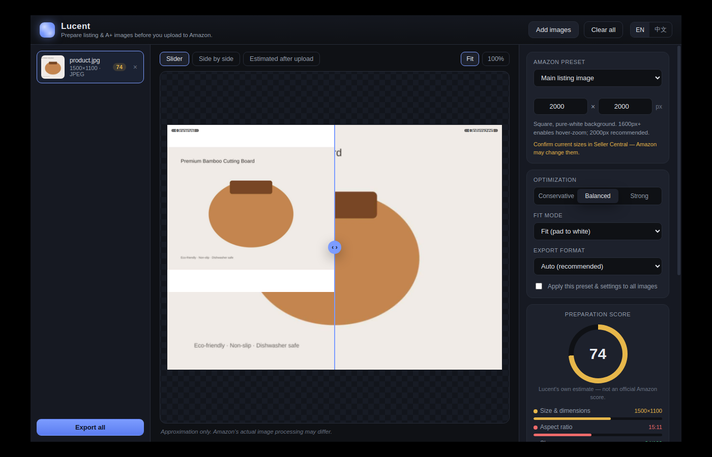

# Lucent

**Prepare Amazon listing & A+ images before you upload — diagnose first, then optimize.**

An image can look perfectly sharp on your screen yet come out soft, blurry, or off-color after Amazon processes it. Lucent is a free, open-source, **local-first** desktop app that helps Amazon sellers, small brands, and listing designers understand *why* that happens and export a version better prepared for Amazon's image pipeline.

Think of it as **PageSpeed Insights for Amazon images**: upload, check, optimize, export.



## Why Lucent

More sellers now create images with AI and design tools (ChatGPT, Midjourney, Flux, Canva…). Those exports are easy to make but often aren't prepared for a marketplace: soft AI textures, already-compressed sources, wrong color profiles, tiny text, or huge pixel dimensions with little real detail. Professionals fix these by hand in Photoshop — most sellers can't.

Lucent's core idea:

> **Diagnose first, explain the problem, then provide one-click optimization.**

The preparation score, the issue report, and the estimated marketplace preview matter as much as the exported file.

## Features

- **Image analysis & preparation score (0–100)** — an overall score plus eight category scores: size & dimensions, aspect ratio, sharpness, compression quality, color profile, text clarity, format suitability, and upscaling risk. Every issue is explained in plain language.
- **One-click optimization** — resize to target, convert to sRGB, light output sharpening, format selection, metadata stripping, transparency flattening. Choose **Conservative / Balanced / Strong** (Balanced is the default).
- **Before-and-after preview** — slider, side-by-side, and 100% zoom.
- **Estimated "after upload" preview** — an approximation of how the image may look after marketplace-style resizing and recompression. *It is only an estimate; Amazon's real processing differs.*
- **Amazon presets** — main image, secondary image, square, standard A+, wide A+ banner, comparison chart, four-image module, Brand Story, and custom. All presets are editable — Amazon changes requirements, so confirm current sizes in Seller Central.
- **Batch processing** — import many images, apply one preset and settings to all, review each individually, export to a single folder.
- **English & Simplified Chinese.**

## Privacy

Lucent is **local-first**. All image processing runs on your computer. There is **no account, no subscription, no cloud storage, no paid API, and no image ever leaves your machine.**

> The preparation score, category grades, and marketplace preview are **Lucent's own estimates — not official Amazon scores**, and Lucent does not perfectly simulate Amazon's pipeline.

A few honest facts the app is built around:
- **Resolution is not detail.** An upscaled or AI-inflated image can be large in pixels yet weak in real detail.
- **Sharpening can't recreate missing detail** — it only improves perceived clarity.
- **Avoid AI-generated text in images;** add text separately in a design tool at full size.
- **Amazon may re-process images** after upload; Lucent prepares for that but can't guarantee identical results.

## Getting started

Requirements: [Node.js](https://nodejs.org/) 18+.

```bash
npm install
npm start
```

### Build a Windows installer

```bash
npm run dist        # builds an NSIS installer for Windows
```

(`npm run dist:all` targets macOS, Windows, and Linux where the host supports it.)

## How it works

- **Electron** shell. The UI (`src/index.html`, `styles.css`, `renderer.js`) runs with `contextIsolation` on and `nodeIntegration` off; it talks to the main process only through the small bridge in `preload.js`.
- **[sharp](https://sharp.pixelplumbing.com/)** (libvips) does all analysis and image processing in the main process.
  - `src/analyzer.js` — computes metadata, a Laplacian-variance sharpness metric, bits-per-pixel compression estimate, color-space check, and the weighted score.
  - `src/optimizer.js` — the resize → sRGB → flatten → sharpen → encode pipeline, previews, the marketplace simulation, and batch export.
  - `src/presets.js` — editable Amazon presets.

## Roadmap

Deliberately **not** in v1: AI image generation, background removal/replacement, Photoshop-style layers, cloud accounts, billing, SP-API integration, auto-publishing. Possible later: small-text detection, AI-text warnings, smart product-focused cropping, local upscaling, logo/comparison-chart readability checks, and profiles for Walmart, Shopify, Etsy, and eBay. The initial product stays focused on doing Amazon image preparation well.

## License

MIT — see [LICENSE](LICENSE).
